<p align="center">
  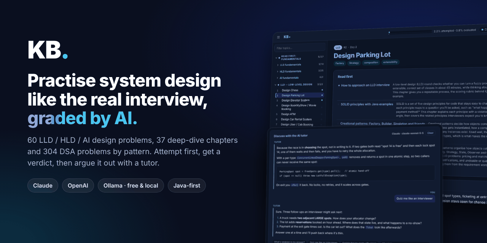
</p>

<h1 align="center">KB · your private AI interview coach</h1>

<p align="center">
  <b>Practise LLD, HLD, AI system design and DSA the way interviews actually work:<br>
  commit to a design, get it graded, then defend it.</b>
</p>

<p align="center">
  <a href="https://github.com/CODINGSAINT/kb/stargazers"></a>
  
  
  
  
</p>

<p align="center">
  <a href="#quick-start-60-seconds">Quick start</a> ·
  <a href="#a-quick-tour">Tour</a> ·
  <a href="#whats-inside">What's inside</a> ·
  <a href="#using-the-kb-command">CLI</a> ·
  <a href="#faq">FAQ</a> ·
  <a href="#full-setup-guide">Full setup guide</a>
</p>

> ⭐ **If KB helps your prep, please star the repo.** It's the easiest way to help other engineers find it.

---

## Why KB?

Most interview prep is passive: you read a solution, nod along, and feel ready. Real interviews aren't like that.
KB makes you **commit to your own design before you see any answer**, then gives you the kind of feedback a senior interviewer would.

| | |
|---|---|
| 🧠 **Attempt first** | Each topic shows only the problem and requirements. The reference design, abstractions and trade-offs stay hidden behind an *"Are you sure?"* until you've tried. |
| ✅ **A real verdict** | One click grades your answer: **Strong / Solid / Partial / Needs work**, what you got right, the gaps, and what to study next. It reads your diagrams too. |
| 💬 **A tutor that pushes back** | Chat about your answer with an AI that knows the topic, your attempt and its verdict. *"Quiz me like an interviewer"* is one click away, and it won't spoil the design before you've tried. |
| 📚 **Fundamentals, done properly** | 37 in-depth chapters (caching, sharding, consensus, SOLID, design patterns, concurrency…), each linked from the problems that need it. |
| 🧩 **DSA by pattern** | 304 problems in 32 patterns, each with a guide and a Java template. The grader checks whether you used the pattern, not just whether the code works. |
| 🔒 **Private and yours** | Plain JSON files on your machine. No account, no tracking. Bring your own Claude or OpenAI key, or run **free and offline** with Ollama. |
| ⌨️ **Site or terminal** | Everything also works from the `kb` command: `kb evaluate lld 2`, `kb clarify hld 7 "why Kafka here?"`, `kb pending --run`. |

---

## What's inside

| Track | Count | Examples |
|---|---|---|
| **Low-level design** | 20 | Chess, Parking Lot, Elevator, BookMyShow, Splitwise, Rate Limiter, Wallet, Calendar |
| **High-level design** | 20 | URL Shortener, Chat/WhatsApp, YouTube, Netflix, Uber, Dropbox, Payments, API Gateway |
| **AI / Spring AI** | 20 | RAG, embeddings, ChatClient, tool calling, agents, MCP, multi-agent, AI security, evaluation |
| **Read-first chapters** | 37 | Approach & estimation, caching, sharding, replication, CAP, consensus, messaging, SOLID, design patterns, concurrency |
| **DSA problems** | 304 | 32 patterns: two pointers, sliding window, binary search, trees, graphs, DP, tries, design… |

Every design topic comes with a reference write-up and a diagram, revealed only when you ask.

---

## Quick start (60 seconds)

You need [Node.js 18+](https://nodejs.org) and git.

```bash
git clone https://github.com/CODINGSAINT/kb.git
cd kb
npm install
npm link        # adds the `kb` command (or use: node bin/kb.js <command>)
kb setup        # pick Claude, OpenAI or Ollama
kb serve        # open http://localhost:4321
```

**No API key?** Install [Ollama](https://ollama.com), run `ollama pull gemma4`, and choose Ollama in `kb setup`. It's free and nothing leaves your machine.

Then open **LLD → Design Parking Lot**, write your design, and click **Evaluate with AI**.
The [full setup guide](#full-setup-guide) covers every step, including Windows tips and opening KB from your phone.

---

## A quick tour

One study loop: **read the fundamentals → attempt the topic → get graded → argue with the tutor → compare with the reference.**
(Screenshots use a sample answer to *Design Parking Lot*.)

### 1. Home: see where you are
The sidebar lists every track: **Read first** fundamentals, LLD, HLD, AI and DSA patterns. A dot marks each item's state: hollow is not started, cyan is attempted, blue is evaluated or read.
The home page shows overall progress. Press `\` to hide or show the sidebar, and use the filter box to find a topic by name.

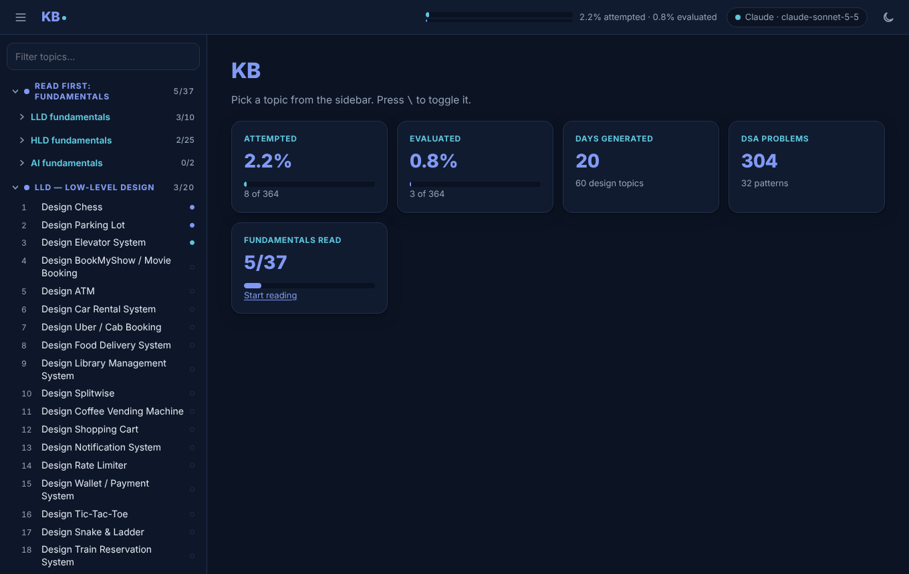

### 2. Open a topic: problem and requirements only
A topic page starts with its **Read first** card, the fundamentals worth reading before you attempt it, each with a short summary and your read status.
Below that you see only the **problem statement and the functional / non-functional requirements**. Nothing that hints at the design.

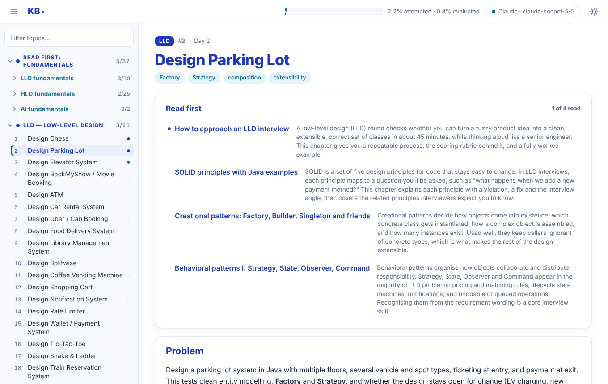

### 3. Read the fundamentals first
Each fundamentals chapter is a long, interview-focused article: concepts, how it works, trade-off tables, Java examples, real systems, pitfalls, interview questions and a cheat sheet.
Use **On this page** to jump between sections, the chips at the top to open the topics it prepares you for, and **Mark as read** at the bottom. Every article has its own tutor chat too.

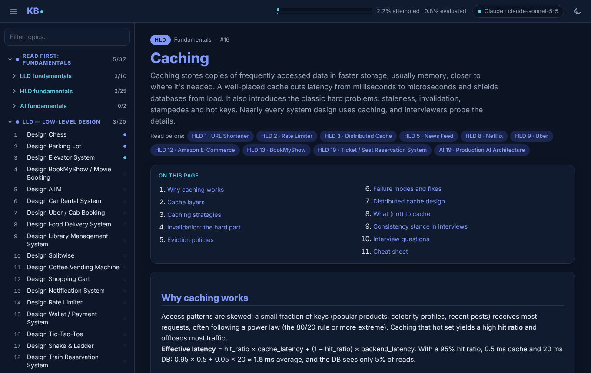

### 4. Write your answer
Write in **Markdown**: headings, lists, and code fenced with ```` ```java ````. Use **Preview** to check it. Paste or drag in a diagram image (Excalidraw export, whiteboard photo);
the AI looks at images when it grades. `Ctrl+S` saves.

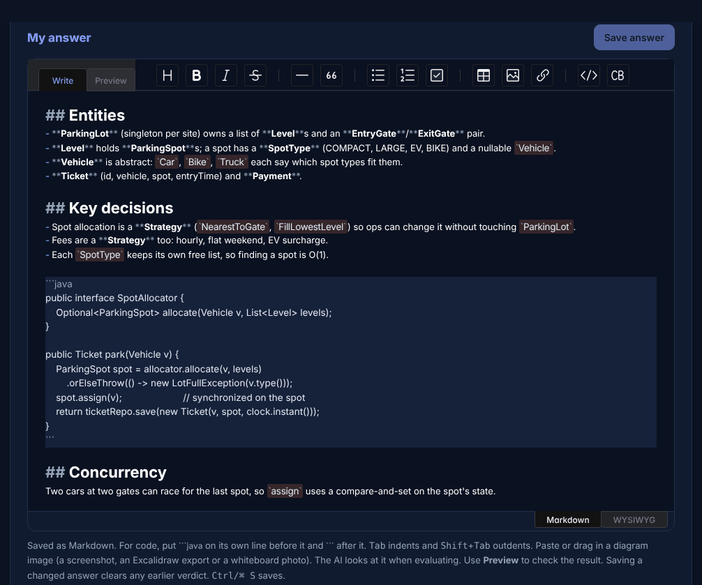

### 5. Evaluate with AI
Click **Evaluate with AI** (or run `kb evaluate lld 2`). You get a verdict (Strong / Solid / Partial / Needs work) with what you got right, the gaps, and what to study next.
Editing your answer afterwards clears the verdict, so **Re-evaluate** always grades the latest version.

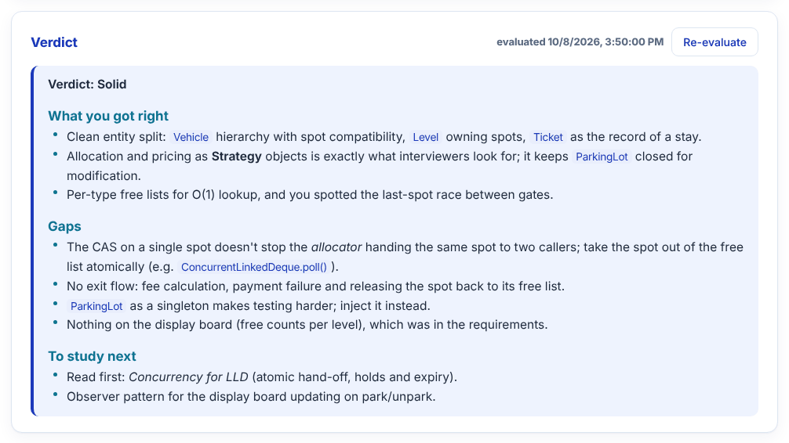

### 6. Discuss it with the tutor
Ask follow-ups in the chat, or click a suggestion chip such as *Quiz me like an interviewer*. The tutor sees the topic, your answer and the verdict.
Until your answer has been evaluated, it coaches without giving away the design. The same conversation is available from a terminal with `kb clarify lld 2 "…"`.

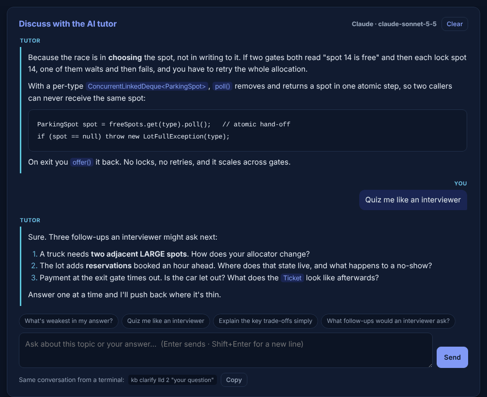

### 7. Reveal the reference design, only when you're ready
The diagram, key abstractions and trade-offs are hidden behind a confirmation, because they are hints. After you've attempted the topic, compare your design with them.

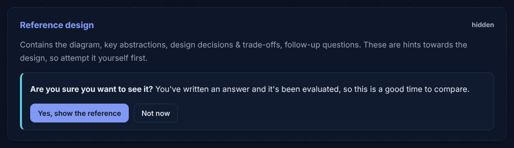

### 8. DSA by pattern
Problems are grouped into 32 coding-interview patterns, ordered so earlier patterns build towards later ones. Each pattern has a **guide** (how to spot it, the core idea, a Java template, pitfalls) and its problems listed easy → hard.

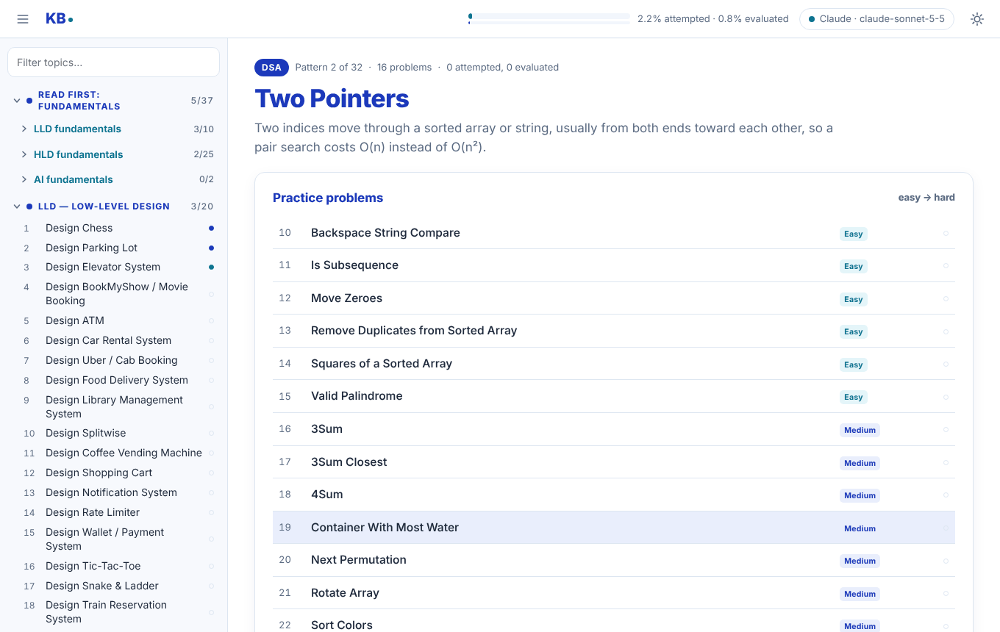

On a problem page, open it on LeetCode, expand the pattern guide if you need it, and write your approach and code. Evaluation and the tutor work exactly as for design topics, and the evaluator also checks whether you applied the pattern.

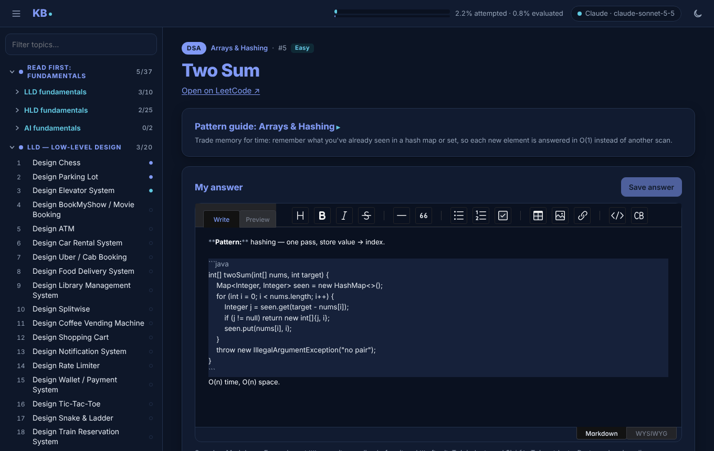

### 9. Choose your AI
Click the AI badge in the top bar to pick **Claude**, **OpenAI** or **Ollama** (local and free), set the model, and paste a key. Keys are saved in `kb.config.json` on your machine (git-ignored) and never sent to the browser.

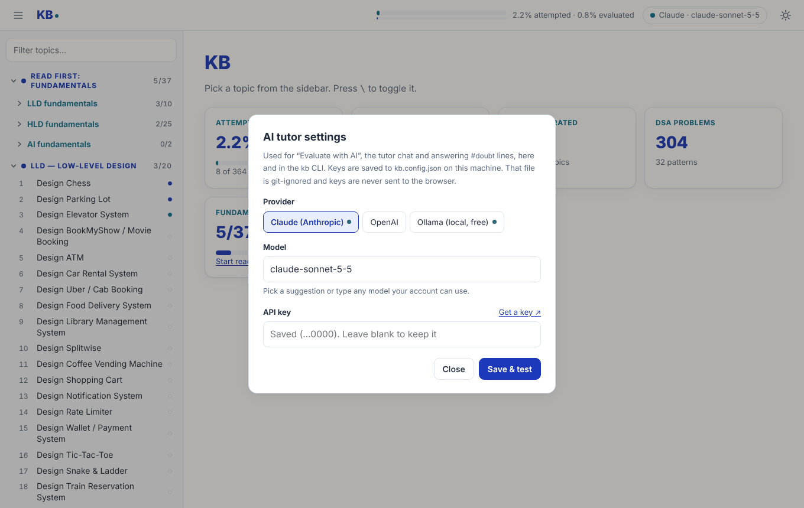

### 10. Terminal and phone
Everything also works from the `kb` command: status, lists, reading, evaluating and chatting. The sun/moon button in the top bar switches between dark and light themes.
With `npm start`, phones and tablets on the same Wi-Fi can open the site too.

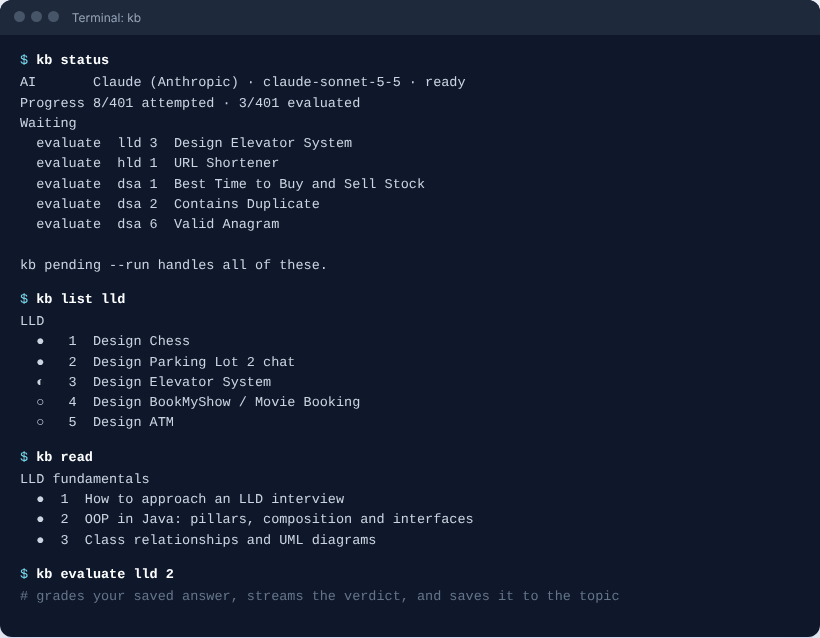

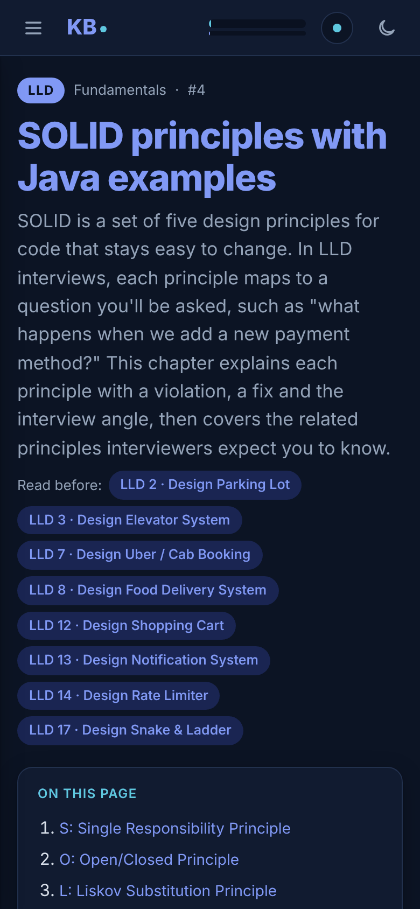

---

## Full setup guide

### Step 1 — Install the prerequisites

| Tool | Version | Check with | Get it |
|---|---|---|---|
| Node.js | 18 or newer (LTS recommended) | `node -v` | [nodejs.org](https://nodejs.org) — use the LTS installer |
| npm | comes with Node | `npm -v` | installed with Node |
| Git | any recent | `git --version` | [git-scm.com](https://git-scm.com) (only needed to clone or publish) |

On Windows, keep **"Add to PATH"** ticked in the Node installer, then open a *new* terminal so `node` and `npm` are found.

### Step 2 — Get the code

Clone it:

```bash
git clone https://github.com/CODINGSAINT/kb.git
cd kb
```

If you were given a zip instead, unzip it and `cd` into the folder that contains `package.json`.

### Step 3 — Install dependencies

```bash
npm install
```

This installs Express (the local web server) and the editor and diagram libraries. Nothing else is downloaded at runtime,
because the editor and fonts are already vendored in `public/vendor/`.

### Step 4 — Make `kb` available as a command (recommended)

```bash
npm link
```

This adds a global `kb` command that points to this folder. Check that it worked with `kb help`.

If `npm link` isn't allowed on your machine (for example, a locked-down work laptop), skip it and use either of these. They are equivalent:

```bash
node bin/kb.js evaluate lld 1
npm run kb -- evaluate lld 1
```

To undo it later, run `npm unlink -g studykb`.

> **Windows PowerShell:** if `kb` fails with *"running scripts is disabled on this system"*, either call `kb.cmd evaluate lld 1`,
> or allow local scripts once with `Set-ExecutionPolicy -Scope CurrentUser RemoteSigned`. Command Prompt (cmd.exe) isn't affected.

### Step 5 — Choose an AI provider and connect it

You only need **one**. You can switch at any time.

#### Option A — Claude (Anthropic)

1. Create a key at [console.anthropic.com → API keys](https://console.anthropic.com/settings/keys). API usage is billed separately from a Claude.ai subscription, so add credit under Billing.
2. Run `kb setup`, choose **1) Claude**, accept the default model (`claude-sonnet-5-5`) or type another, then paste the key.
3. `kb setup` sends a short test message and prints **works** when it succeeds.

Model choices: `claude-sonnet-5-5` (default, good balance), `claude-opus-5-5` (deepest reviews, costs more), `claude-haiku-4-5-20251001` (fastest and cheapest).

#### Option B — OpenAI

1. Create a key at [platform.openai.com → API keys](https://platform.openai.com/api-keys) and make sure the account has credit.
2. Run `kb setup`, choose **2) OpenAI**, enter a model your account can use (default `gpt-5`), keep the base URL, and paste the key.

**Other OpenAI-compatible services** (Azure OpenAI, OpenRouter, LM Studio, Groq and so on) work through this same option.
Enter that service's **base URL** and model name, plus its key if it needs one.

#### Option C — Ollama (free, fully offline)

1. Install Ollama from [ollama.com](https://ollama.com). On Windows and macOS it runs in the background after install. On Linux, run `ollama serve`.
2. Download a model: `ollama pull llama3.1` (others such as `qwen2.5` or `mistral` also work).
3. Run `kb setup`, choose **3) Ollama**, and enter the model name you pulled. No key is needed.

Local models are free and private, but their reviews are noticeably weaker than Claude's or OpenAI's.

#### Setting it up from the site instead

Start the site (Step 6), click **Set up AI** in the top bar, pick a provider, fill in the model and key, then click **Save & test**.
This writes the same `kb.config.json` that `kb setup` does.

#### Using environment variables instead of a saved key

If you'd rather not keep the key in a file, set it in your environment. Environment variables take priority over `kb.config.json`.

| Variable | Purpose |
|---|---|
| `ANTHROPIC_API_KEY` | Claude key |
| `OPENAI_API_KEY` | OpenAI key |
| `OPENAI_BASE_URL` | OpenAI-compatible endpoint |
| `OLLAMA_BASE_URL` | Ollama endpoint (default `http://localhost:11434/v1`) |
| `KB_PROVIDER` | `anthropic`, `openai` or `ollama` |
| `KB_MODEL` | model name override |

```powershell
# Windows PowerShell: current window only
$env:ANTHROPIC_API_KEY = "sk-ant-..."
# Windows: permanent (open a new terminal afterwards)
setx ANTHROPIC_API_KEY "sk-ant-..."
```

```bash
# macOS / Linux: add to ~/.zshrc or ~/.bashrc to make it permanent
export ANTHROPIC_API_KEY="sk-ant-..."
```

### Step 6 — Start the site

```bash
kb serve        # or: npm start
```

Open **http://localhost:4321** on this computer, or **http://<this-computer's-IP>:4321** (e.g. `http://192.168.1.53:4321`) from another device on the same Wi-Fi. The terminal prints the exact addresses and which AI is connected:

```
KB running on your local network · AI: anthropic (claude-sonnet-5-5)
  This computer:        http://localhost:4321
  By IP (changes):      http://192.168.1.53:4321
```

Keep that terminal open while you study, and press `Ctrl+C` to stop the site. You don't need to restart it after editing files,
because every request reads the JSON fresh.

To use a different port, set `PORT` first: `$env:PORT=5000; npm start` in PowerShell, or `PORT=5000 npm start` in bash.

### Open KB from your phone or tablet on the same Wi-Fi (optional)

KB has three start modes:

| Command | Who can open it | Address |
|---|---|---|
| `npm start` (or `kb serve`), the default | this computer and devices on your local network | `http://localhost:4321`, `http://<IP>:4321` |
| `npm run start:lan` (or `kb serve --lan`) | the same, on port 80 | `http://kb` on Windows PCs, `http://kb.local` on phones, iPads and Macs |
| `npm run start:local` (or `kb serve --local`) | only this computer | `http://localhost:4321` |

Every mode refuses any request that doesn't come from a private (home or office network) address, so nothing is reachable from the internet.
The IP address can change when you switch Wi-Fi; port-80 mode lets you use the computer's name instead, which keeps working.

One-time Windows setup (run PowerShell **as administrator**):

```powershell
Rename-Computer -NewName "KB" -Restart        # the name other devices will type; restarts the PC
New-NetFirewallRule -DisplayName "KB study site" -Direction Inbound -Protocol TCP -LocalPort 80,4321 -Action Allow -Profile Private
```

Then, under Settings → Network & internet → Wi-Fi → your network, set **Network profile type** to **Private**.
The firewall rule only opens ports 80 and 4321 on networks marked Private, never on public Wi-Fi.

To use a computer name other than KB, the addresses become `http://<name>` and `http://<name>.local`; the startup message prints them.
If port 80 is taken, use the default `npm start` and open `http://kb:4321`.

### Step 7 — Check everything works

```bash
kb status
```

You should see something like:

```
AI       Claude (Anthropic) · claude-sonnet-5-5 · ready
Progress 0/401 attempted · 0/401 evaluated
Nothing pending.
```

### Step 8 (optional) — Start from a clean slate

If you cloned someone else's copy, it may contain their answers and chats. Wipe them, keeping all the write-ups:

```bash
kb reset --yes
```

### Your first session, end to end

1. On the site, open **LLD → 1 Design Chess** and work through its **Read first** articles. The page shows only the problem and requirements; the reference design stays hidden.
2. Write your design in **My answer** and save it with `Ctrl+S`.
3. Click **Evaluate with AI**. After 10–40 seconds the verdict appears: *Strong / Solid / Partial / Needs work*, followed by what you got right, the gaps and what to study next.
4. Ask a follow-up in **Discuss with the AI tutor**, such as *"Why should Board be separate from Game?"*, or click **Quiz me like an interviewer**.
5. At the bottom, click **Show reference design…** and confirm, to compare your answer with the reference.

The same session from a terminal:

```bash
kb answer lld 1 my-chess.md        # or write it on the site
kb evaluate lld 1
kb clarify lld 1 "why should Board be separate from Game?"
kb chat lld 1                      # back-and-forth; /exit to leave
```

---

## Using the `kb` command

Topics are addressed by track and number: `lld 1`–`lld 20`, `hld 1`–`hld 20`, `ai 1`–`ai 20`, `dsa 1`–`dsa 304`, and `read 1`–`read 37` for the fundamentals.
`lld1` and `LLD-1` also work. Run `kb list` to see every number.

| Command | What it does |
|---|---|
| `kb evaluate lld 1` | Grades your saved answer and saves the verdict (alias: `kb eval`) |
| `kb clarify lld 1 "question"` | Asks about the topic and continues its conversation (alias: `kb ask`). Quotes are optional |
| `kb chat lld 1` | Interactive conversation. Use `/exit` to quit, `/clear` to reset and `/history` to reprint it |
| `kb history lld 1` | Prints the conversation |
| `kb clear lld 1` | Clears the conversation |
| `kb doubts [lld 1]` | Answers open `#doubt` lines in notes, for every topic if you leave the address off |
| `kb pending` | Lists unevaluated answers and open doubts |
| `kb pending --run` | Evaluates all of those answers and answers all of those doubts |
| `kb list [lld\|hld\|ai\|dsa]` | Lists topics with status: ○ untouched, ◐ attempted, ● evaluated |
| `kb show lld 1 [--writeup]` | Prints your answer and verdict, plus the reference write-up with `--writeup` |
| `kb answer lld 1 file.md` | Saves an answer from a file (`-` reads stdin) and clears any old verdict |
| `kb setup` | Chooses the provider, model and key, then tests the connection |
| `kb status` | Shows the AI settings, progress and pending items |
| `kb serve` | Starts the site |
| `kb reset --yes` | Wipes all answers, verdicts, notes and chats (write-ups stay) |

**One run on a different model:** add `--provider openai`, `--provider ollama` or `--model claude-opus-5-5` to any AI command.
This doesn't change your saved settings.

**The site and the CLI share everything.** A question asked with `kb clarify` appears in that topic's chat on the site, and the reverse.
The same goes for verdicts and doubt answers. Reload the page to see changes made from the terminal.

---

## Using the site

- **Sidebar** (toggle with `\`): grouped LLD / HLD / AI / DSA. Status dots: hollow = untouched, cyan = attempted, blue = evaluated (or read).
- **Reference design**: the diagram, abstractions or architecture, and trade-offs stay hidden behind a confirmation until you choose to compare.
- **My answer**: a rich editor that saves as Markdown. `Ctrl/⌘ S` saves. Changing a saved answer clears its old verdict.
- **Verdict**: **Evaluate with AI**, or **Re-evaluate** once a verdict exists. Any unsaved edits are saved first.
- **Discuss with the AI tutor**: a streaming chat for each topic. The tutor sees the write-up, your answer and your verdict.
  Quick prompts include *Quiz me like an interviewer* and *What's weakest in my answer?* **Clear** starts the conversation over.
- **Diagrams**: paste (`Ctrl+V`), drag in, or use the toolbar's image button to add a screenshot, an Excalidraw/draw.io export, or a phone photo of a whiteboard.
  Images are saved as files in `content/images/`, and **the AI looks at them** when it evaluates, chats or answers doubts, comparing them against your text.
  This works with Claude, GPT-5 and vision models in Ollama (such as `gemma4`). If a model can't read images, the evaluation still runs and the verdict notes that the diagrams were skipped.
  PNG, JPEG, GIF and WebP are supported, at most 6 images per answer and 5 MB each.
- **Notes & doubts**: free-form notes. Put `#doubt your question` on its own line, then click **Answer with AI**.
  The reply is written under it as `#doubt-answer …`.
- **AI chip** (top bar): shows the connected provider and model. Click it to change settings.

---

## Where your data is saved

Everything is stored in this folder. There's no database and no cloud storage.

| What | Where | In git? |
|---|---|---|
| AI provider, model, API key | `kb.config.json` (created by `kb setup` or the site's settings) | **No**, it's git-ignored |
| Images in your answers | `content/images/` (file names are content hashes) | Yes |
| Answers, verdicts, notes and chats for `lld N`, `hld N`, `ai N` | `content/day-NN.json` (e.g. `lld 1`, `hld 1` and `ai 1` are all in `day-01.json`) | Yes |
| Same for `dsa N` | `content/dsa.json` | Yes |
| Theme, sidebar state, revealed reference designs | browser localStorage | — |

Inside each topic, the fields are `userAnswer`, `answerEvaluation` and `answerEvaluatedAt`, `notes`, and `chat`.
`AUTHORING.md` documents the format.

**What leaves your machine:** only when you use an AI feature. Each request sends that topic's write-up, your answer (including its images),
the verdict and the recent chat (last 24 messages) to your chosen provider. With Ollama, nothing leaves your machine.

**Security:** the server answers only this computer and private local-network addresses (anything else gets 403), because its AI routes spend your credit.
Run `npm run start:local` to restrict it to this computer only. API keys are never sent to the browser; the settings dialog only shows the last 4 characters.

**Backups:** copy the `content/` folder. Committing to a private git repo also works as a backup.

---

## Publishing to git

`.gitignore` already excludes `node_modules/`, `kb.config.json`, zips, temp files and your sketch images.

```bash
git init
git add .
git commit -m "KB study site"
git branch -M main
git remote add origin https://github.com/<you>/kb.git
git push -u origin main
```

Before pushing, run `git status` and confirm `kb.config.json` is **not** listed.

Your answers and chats live in `content/`, so they get committed too. That's fine for a private repo.
For a public repo, publish from a separate copy where you've run `kb reset --yes`, so others start clean and your work stays private.

`.gitattributes` keeps every file on LF line endings, so the JSON diffs stay readable across Windows and macOS.

**Pulling updates later:** run `git pull` and then `npm install`. Your `kb.config.json` is untouched.
If an update edits the same topic file as your answers, git asks you to resolve the conflict.

---

## Troubleshooting

| Symptom | Fix |
|---|---|
| `kb` is not recognized | Run `npm link` again from the project folder and open a new terminal, or use `node bin/kb.js …` |
| PowerShell: *running scripts is disabled* | Use `kb.cmd …`, or run `Set-ExecutionPolicy -Scope CurrentUser RemoteSigned` |
| *No API key for Claude* | Run `kb setup`, or click **Set up AI** on the site |
| *rejected the API key (401/403)* | The key is wrong or revoked. Paste it again with `kb setup` |
| *Model "…" not found (404)* | Your account can't use that model. Pick another in `kb setup` or the site's settings |
| *Rate limited or out of credit (429)* | Add credit or billing in the provider console, or wait a minute |
| *Can't reach api.anthropic.com / api.openai.com* | You're offline, or a VPN or corporate proxy is blocking the call. Try another network, or use Ollama |
| *Can't reach Ollama* | Start Ollama (`ollama serve`) and check the model is pulled with `ollama list` |
| *EADDRINUSE* when starting | Port 4321 is busy. Use `PORT=5000 npm start` (bash) or `$env:PORT=5000; npm start` (PowerShell) |
| Changes from the CLI don't show on the site | Reload the page. The site reads files fresh on every load |
| *no answer saved yet* | Save an answer on the site first, or use `kb answer lld 1 file.md` |
| Want a fresh start | `kb reset --yes` |

---

## Project layout

```
server.js                Express: static files + JSON API + AI routes (Cache-Control: no-store everywhere)
bin/kb.js                the `kb` command
lib/store.js             read/write content JSON; addresses like "lld 1"
lib/ai.js                provider layer (Claude, OpenAI-compatible, Ollama), streaming, kb.config.json
lib/tutor.js             evaluate / clarify / doubts, with the prompts, shared by the CLI and the server
lib/images.js            answer images: save to content/images, attach to prompts as real image inputs
public/                  index.html, app.js, diagram.js (rough.js renderer), styles.css, vendor/
content/day-NN.json      3 topics per file (LLD, HLD, AI): write-up, diagram, your answer, verdict, notes, chat
content/dsa.json         DSA problems grouped by pattern, with guides and your answers
content/fundamentals.json  the read-first chapters, built from build/fundamentals/*.md
docs/screenshots/        images used in this README
build/                   assemble.js + topics/*.txt (all 60 write-ups); make-dsa-patterns.js + dsa/ (problem list, pattern map, guides); toastui-entry.js
scripts/                 new-day.js, study-parser.js, generate-day.sh (older Claude Code CLI workflow), pending.js
AUTHORING.md             the JSON contract, for anyone (or any assistant) editing content by hand
kb.config.example.json   example AI settings file
```

### Rebuilding content and the editor

- `npm run build:content` rebuilds `content/day-*.json` from `build/topics/*.txt`. It keeps your answers, notes, verdicts and chats.
- `npm run build:editor` re-bundles the vendored Toast UI editor. The raw npm `dist` file breaks in a plain `<script>` tag, so it's bundled with esbuild.

## How topic pages work (attempt first)

Each LLD, HLD and AI topic page shows only the brief: **Problem** and **Requirements** (functional and non-functional for LLD/HLD).
Everything that would steer your design (the diagram, key abstractions or architecture, design decisions and trade-offs, follow-up questions)
sits in a **Reference design** card at the bottom. It's hidden until you click it and confirm, and the confirmation tells you whether you've saved and evaluated an attempt yet.
Your choice is remembered per topic (*Hide again* puts it back).

The AI tutor follows the same rule. Until your attempt has been evaluated, it coaches with questions and hints instead of giving away the reference design.
If you explicitly ask for the solution, it gives it.

## Read-first fundamentals

37 in-depth chapters (roughly 2,500–4,000 words each) to read before attempting topics, written for this site. Each covers the concepts, how it works, trade-off tables, Java/Spring or config examples, real systems, where it shows up in the interview topics, pitfalls, interview questions and a cheat sheet. Long chapters open with an *On this page* contents list.
- **LLD (10):** approach, OOP, UML relationships, SOLID, creational, structural and behavioral patterns, concurrency, modelling details (money, time, IDs).
- **HLD (25):** approach, estimation, scalability, networking (DNS, TCP/UDP, HTTP, TLS, proxies), load balancing, caching, CDN and object storage, SQL vs NoSQL, indexes, replication, sharding,
  consistent hashing, CAP/PACELC, consensus, messaging, batch and stream processing, idempotency, distributed transactions, API design, real-time, rate limiting, IDs and probabilistic structures, geospatial indexing, observability and resilience, security (authn/authz, OAuth2/JWT, TLS/mTLS, secrets).
- **AI (2):** approaching AI system design, and Spring Boot/Reactor essentials for Spring AI.

Every topic page starts with a **Read first** card listing its prerequisites, with read status. Each article lists the topics it prepares you for,
has a *Mark as read* button, and has its own tutor chat. From the terminal, `kb read` lists the articles, `kb read sharding` prints one, `kb read 21 --done` marks one read,
and `kb clarify read 21 "…"` asks about it. Sources live in `build/fundamentals/*.md`, and the topic → prerequisite map lives in `build/make-fundamentals.js`.
`node build/make-fundamentals.js` rebuilds `content/fundamentals.json` and keeps your read status and chats.

## About the DSA track

DSA is organised by **coding-interview pattern** rather than by data structure, in learning order:
Arrays & Hashing → Two Pointers → Sliding Window → Prefix Sum → Fast & Slow Pointers → Merge Intervals → Cyclic Sort →
Linked List → Stack → Modified Binary Search → Divide & Conquer → Tree BFS → Tree DFS → BST → Two Heaps → Top K → K-way Merge →
Subsets → Backtracking → Graphs → Topological Sort → Union-Find → Shortest Paths/MST → Greedy → DP (1-D, Knapsack, 2-D) →
Bits → Trie → Strings → Matrix & Math → Design.

- **Pattern guide pages** (sidebar ◆ *Pattern guide*, or `kb pattern <n>`): how to spot the pattern, the core idea, a Java template, complexity and pitfalls.
  The AI tutor gets the guide when it evaluates or discusses a problem from that pattern, and it checks whether you applied the pattern.
- **Problems**: 304, listed in `build/dsa/problems.json`. Each problem belongs to one primary pattern and is listed easy → hard.
  Most link to LeetCode; 66 are classics (e.g. *Aggressive Cows*, *Dijkstra*) with no exact LeetCode match, so they have no link or difficulty.
- `node build/make-dsa-patterns.js` rebuilds `content/dsa.json` from `build/dsa/`. Each problem's pattern is set in that script's `MAP`, and its guide in `build/dsa/guides/<pattern>.md`.
  Your answers, verdicts, notes and chats are carried over by a stable `key` (the LeetCode slug, or `classic-<name>`).
- DSA numbers (`kb evaluate dsa 29`) follow pattern order and run from 1 to 304.

---

## Who it's for

- **Engineers preparing for senior / staff interviews** who want to practise designing, not just read designs.
- **Java and Spring developers.** Examples, templates and the reference designs are Java-first, and the AI track is built around Spring AI.
- **Anyone learning AI engineering.** Twenty topics take you from embeddings and RAG to tool calling, agents, MCP and production AI architecture.
- **Interviewers and mentors** who want a ready-made question bank with reference designs and a grader.

## FAQ

**Is it free?**
The code is free. AI features use your own provider account, so Claude or OpenAI bill you per use (a typical evaluation costs cents). With Ollama it's completely free.

**Does my work leave my computer?**
Only when you use an AI feature, and only to the provider you chose: that topic's write-up, your answer and the recent chat. With Ollama nothing leaves your machine. There's no KB server, account or analytics.

**Do I have to answer in Java?**
No. Write in any language or in plain prose with diagrams. The reference material is Java-flavoured, but the grader judges the design.

**Can I add my own questions?**
Yes. Content is plain JSON and Markdown. [AUTHORING.md](AUTHORING.md) documents the format, and the build scripts keep your answers when you rebuild.

**Can I use it on my phone?**
Yes. `npm start` serves it to devices on your home Wi-Fi (never the internet). Open `http://<your-computer's-IP>:4321`.

## Contributing

Contributions are welcome, especially:
- new LLD / HLD / AI topics with a reference design,
- improvements to the fundamentals chapters and DSA pattern guides,
- bug fixes and UI polish.

Open an issue to discuss an idea, or send a pull request. Please run `kb reset --yes` on your copy before committing, so your personal answers stay out of the PR.

## Support the project

If KB helped you prepare:
- ⭐ **Star this repo**, so more people find it.
- 🔁 **Share it** with a friend who's preparing for interviews.
- 📺 For Java, Spring Boot, microservices and Spring AI, see **[Coding Saint on YouTube](https://www.youtube.com/@codingsaint)**.

<p align="center">Built by <b>Pallav</b> · Java &amp; AI architect · <a href="https://www.youtube.com/@codingsaint">Coding Saint</a></p>
